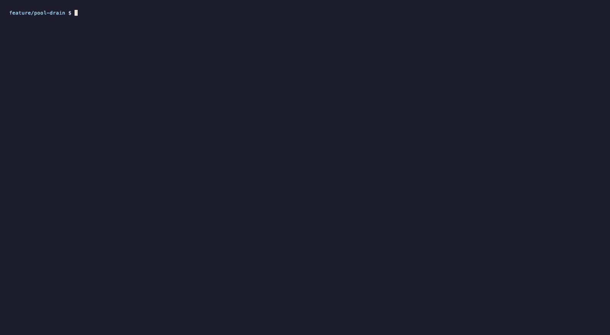
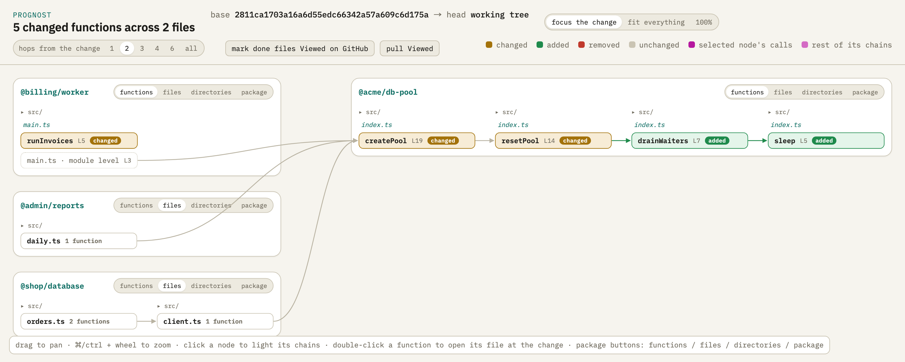

<p align="center">
  
</p>

<p align="center">
  <b>Read a change's prognosis before it ships.</b><br>
  Like <code>terraform plan</code>, for code: what a diff touches, how far it reaches<br>
  through the code that calls it, and what in that reach looks risky.
</p>

<p align="center">
  <a href="#license"></a>
  
  
</p>

<p align="center">
  
</p>

A diff is a diagnosis: it says what changed. It doesn't say what follows —
the route three packages away that now waits on a new drain loop, the worker
that started querying once per invoice, the migration that rewrites a busy
table. **prognost** gives the prognosis. It reads both revisions of a
TypeScript codebase, works out which functions really changed, follows
everything that calls them up to the entry points, and checks that reach
against rules — statically, deterministically, without running anything.

The way `terraform plan` shows what an apply would touch before it happens,
`prognost plan` shows what a change reaches before it merges, and
`prognost assess` judges that plan with rules, the way a policy check
judges a terraform plan.

- **Reviewers** walk the change from what it touches to where it's used,
  instead of reading files in alphabetical order.
- **Authors** see who they affect before asking for review.
- **CI** fails a pull request on the risks a team cares about.
- **Agents** get the facts as JSON instead of guessing from a diff.

It is not a linter (it judges a change, not a codebase), not a test or
coverage tool, and not a runtime tracer: everything comes from the two
revisions in git.

## Install

```sh
brew install azihsoyn/tap/prognost   # Homebrew (macOS/Linux)
cargo install --git https://github.com/azihsoyn/prognost   # or from source (Rust 1.90+)
```

Or the prebuilt binary for macOS or Linux, from the
[latest release](https://github.com/azihsoyn/prognost/releases/latest):

```sh
curl --proto '=https' --tlsv1.2 -LsSf https://github.com/azihsoyn/prognost/releases/latest/download/prognost-installer.sh | sh
```

It needs `git` on the `PATH`.

## Quick start

```sh
cd your-repo
prognost graph                              # walk the change in the terminal
prognost plan                               # what it reaches
prognost plan --json | prognost assess -    # what in that looks risky
```

Every command diffs from the merge base of `--base` (default: the remote's
default branch) and `--head` (default: the working tree), like
`git diff base...head`. The base is read straight from git's object store;
nothing is checked out.

To try it on the code in the demo above:

```sh
docs/demo/make-demo-repo.sh /tmp/prognost-demo
cd /tmp/prognost-demo && prognost graph --base main
```

## graph: walk it

`prognost graph` draws the changed functions grouped by package, with their
callers and callees. Move with the arrow keys or `hjkl`: `←` steps to a
caller (finding more as you go), `→` to a callee, `Enter` opens the diff of
the selected function, `z`/`Z` folds a package into files or directories,
`v` marks a file seen.

`prognost graph --html page.html` writes the same graph as a single web page
— click a function to light up every chain through it, double-click to read
its diff — and `prognost serve` serves it with seen marks kept in sync with
GitHub's *Viewed* checkboxes.

<p align="center">
  
</p>

## plan: what changes, and how far it reaches

```
$ prognost plan --base main
Changed symbols: 5  (~3 changed, +2 added, -0 removed)
  ~ createPool  packages/db-pool/src/index.ts:19  ← 9 fn / 5 pkg · public
  + drainWaiters  packages/db-pool/src/index.ts:7  ← 9 fn / 6 pkg
  ~ resetPool  packages/db-pool/src/index.ts:14  ← 9 fn / 6 pkg
  + sleep  packages/db-pool/src/index.ts:5  ← 9 fn / 6 pkg
  ~ runInvoices  apps/billing/worker/src/main.ts:5

Other changed files: 1
  + apps/shop/database/migrations/0002_order_note.sql

Reach: 9 functions in 6 files / 5 packages, entry points: 4 export, 1 module, 2 route
  @shop/database ← 3   @shop/api ← 2   @shop/web ← 2   @admin/reports ← 1   @billing/worker ← 1

Plan: 2 to add, 3 to change, 0 to remove (3 files); reaching 9 functions in 5 packages.
```

A plan states facts and judges nothing. `--json` gives the facts — every
file, every function (changed and upstream), every call between them with
its line — and a summary derived from them. See [docs/plan.md](docs/plan.md).

## assess: what in it looks risky

```
$ prognost plan --base main --json | prognost assess -
  ⚠ high   migration-domain-rewrite           adds column gift_message of domain type nonempty_text, which has a CHECK: PostgreSQL rewrites the whole table under an exclusive lock
             apps/shop/database/migrations/0002_order_note.sql:2  ALTER TABLE orders ADD COLUMN gift_message nonempty_text;
  ⚠ high   migration-not-null-without-default adds NOT NULL column note without a DEFAULT: fails on existing rows, and the previous release's inserts omit it
             apps/shop/database/migrations/0002_order_note.sql:1  ALTER TABLE orders ADD COLUMN note text NOT NULL;
  ⚠ high   public-api-change                  createPool changes behaviour; imported by 3 other packages (@admin/reports, @billing/worker, @shop/database), reaching 9 functions in 5 packages
             packages/db-pool/src/index.ts:19  export const createPool = (options: PoolOptions): Pool => {
  ⚠ medium await-in-loop                      new await inside a loop in runInvoices: one round trip per iteration (N+1 if it queries)
             apps/billing/worker/src/main.ts:7  await pool.query('UPDATE invoices SET charged = true WHERE id = $1', [id]);
  · low    await-in-loop                      new wait inside a loop in drainWaiters: polls until a condition holds
             packages/db-pool/src/index.ts:10  await sleep(25);
  · low    wide-reach                         resetPool is reached from 9 functions in 6 packages (6 entry points)
             packages/db-pool/src/index.ts:14  const resetPool = async (pool: Pool, timeoutMs: number) => {

Assessment: 3 high, 1 medium, 2 low.
```

Each finding names the rule, the place (`file:line`) and the line itself.
`plan` and `assess` are two steps on purpose, the way `terraform plan` and a
policy check are. Rules are data: presets for the call graph, TypeScript
and PostgreSQL migrations ship built in, and a repository adds, replaces or
turns off rules in its `prognost.toml`. `--sarif` folds in other analysers'
results on the lines the diff added, and `--fail-on high` makes it a CI
gate. See [docs/rules.md](docs/rules.md).

## How it works

1. tree-sitter turns every function-like construct in both revisions into a
   node — named declarations and anonymous callbacks alike.
2. An aligner matches base nodes to head nodes, most confident signal
   first: exact name, then identical normalized body, then position under
   an already-matched parent. A function that only moved lines is the same
   node; one whose body changed is *changed*.
3. Calls are resolved across files through imports, barrels, workspace
   packages and tsconfig paths, and across the HTTP boundary through Hono's
   typed client. A repository adds its own string-keyed seams (an event
   name, a queue) in `prognost.toml`.
4. From each changed function, callers are followed up to the entry points:
   routes, components, module code, exports nothing calls.

The graph is inferred: dynamic dispatch, dependency injection and callbacks
handed through untyped values can hide an edge, so reach is a lower bound,
never a proof that something else is safe. What it reads is listed below.

## What it supports

| | | |
|---|---|---|
| **Languages** | TypeScript, JavaScript (`.ts` `.tsx` `.js` `.jsx` `.mts` `.cts` `.mjs` `.cjs`) | ✅ functions, calls, imports |
| | Svelte components (`.svelte`) | ✅ the `<script>` blocks; markup is not parsed |
| | Vue single-file components, Angular templates | ❌ the files appear in `plan`, their calls are not followed |
| | Any other language | ❌ the files appear in `plan`, their calls are not followed |
| **Modules** | relative imports, package names, barrels (`export * from`), tsconfig `paths` | ✅ |
| | CommonJS `require` | ◐ files that `require` a module count as importing it; calls through the binding are not resolved |
| **Workspaces** | pnpm (`pnpm-workspace.yaml`), npm and yarn (`package.json` `workspaces`) | ✅ |
| | a single package | ✅ |
| **Across HTTP** | Hono's typed client (`client.api.….$post`) → its routes | ✅ |
| | `fetch`, axios, other clients | ➖ add a [seam](docs/config.md#seams-calls-joined-by-a-string) |
| **Across strings** | events, queues, job names, DI tokens | ➖ add a [seam](docs/config.md#seams-calls-joined-by-a-string) |
| **Risk rules** | call graph (public API, reach), TypeScript (await in loops), PostgreSQL migrations | ✅ built in |
| | anything else | ➖ your own `[[risk]]` rules, or another analyser's SARIF |
| **Platforms** | macOS, Linux | ✅ tested in CI |
| | Windows | ❔ untested; the editor key and commit extraction call `sh` and `tar` |

✅ supported · ◐ partly · ➖ through configuration · ❌ not supported · ❔ unknown

## Why not an LLM

Node identity, alignment, call resolution and every rule are deterministic —
the same diff always gives the same plan, and the same plan the same
assessment. That is what makes the output something to diff, cache, gate a
merge on, or hand to an agent as ground truth.

## Inside herdr

In a [herdr](https://herdr.dev) pane, `prognost graph` run by a coding agent
or a script — anything without a terminal — opens in a pane beside the
caller, and `o` opens the selected function in your editor in another pane
while the graph stays up. See [docs/graph.md](docs/graph.md#inside-herdr).

## Commands

```sh
prognost graph [--html <file>]       # the diff as a graph: terminal, or a web page
prognost serve [host:port]           # the web page over HTTP, synced with GitHub's Viewed
prognost plan [--json]               # what changes and how far it reaches
prognost assess [<plan.json> | -]    # the plan's risks, by rules; --sarif, --fail-on
prognost rules                       # the rules in force here
prognost align <file>[:<symbol>]     # one file: its functions aligned across the revisions
prognost cache [clean]               # the commit trees kept between runs, or remove them
```

Output is coloured on a terminal and plain when piped. `--color
auto|always|never` (or `--no-color`) chooses explicitly; `NO_COLOR` and
`CLICOLOR_FORCE` are honoured.

## Documentation

- [docs/graph.md](docs/graph.md) — the graph's keys, the web page, `serve`, herdr
- [docs/plan.md](docs/plan.md) — `plan` and `assess`, and the JSON they print
- [docs/rules.md](docs/rules.md) — writing and choosing risk rules
- [docs/config.md](docs/config.md) — `prognost.toml`, seams, environment, what is analysed
- [docs/ci.md](docs/ci.md) — running it on pull requests

## License

Licensed under either of [Apache License, Version 2.0](LICENSE-APACHE) or
[MIT license](LICENSE-MIT) at your option.
